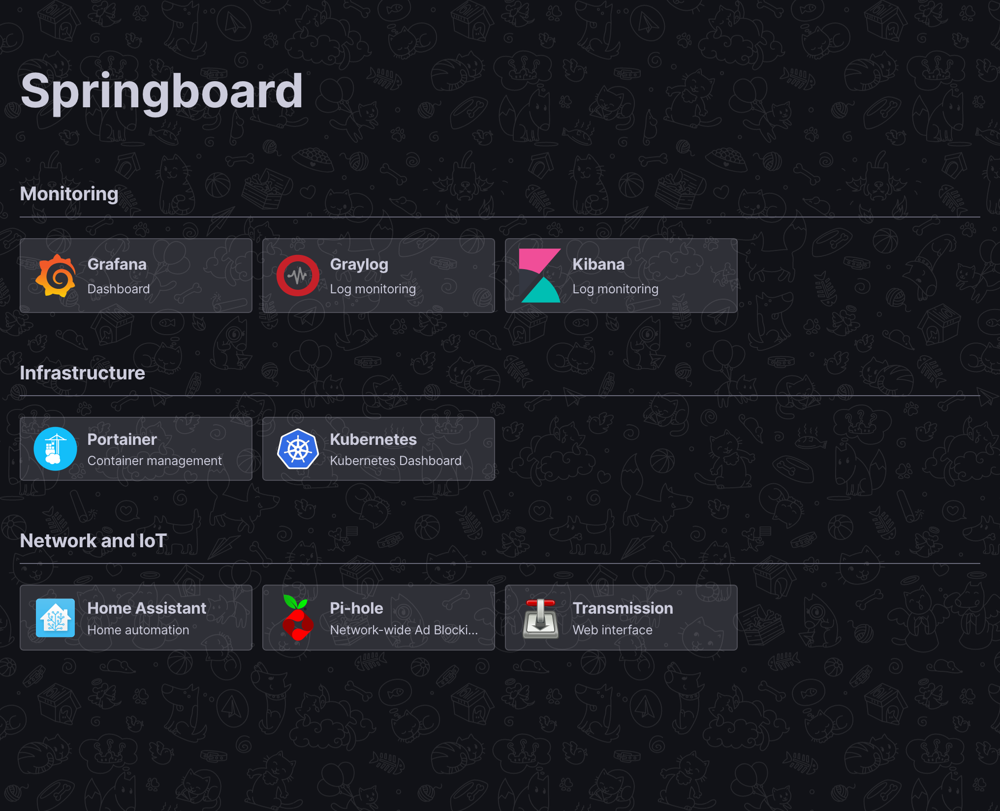

# Springboard

Simple and configurable services dashboard for server and IoT infrastructure.



## Usage

### Docker

Project provides a simple HTTP server based on [static-file-server](https://hub.docker.com/r/halverneus/static-file-server/) Docker image.

Just create a new config from [example](config/config.example.json) and mount it as `/var/www/config/config.json`.

```yaml
services:
  dashboard:
    image: x1unix/springboard
    volumes:
      ./config:/var/www/config
    ports:
      - '8080:8080'
```

### Standalone

This project can be easily served as a directory via any other HTTP server.

* Grab the latest release from [here](https://github.com/x1unix/springboard/releases/latest).
* Copy and edit default config file (see [docs](docs/config.md)).
* Serve the folder contents using your favorite web server (e.g. Nginx).
